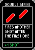
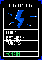
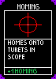

# Upgrady a karty

**Stav:** postaveno · otestováno hraním: **zatím ne** · `[OVĚŘENO 04.10.2026]`

## Co to je

Po každé vyčištěné vlně (mimo Hardcore) hra nabídne **karty upgradů**. Hráč jednu vybere —
**klik na kartu dá upgrade a spustí další vlnu**. Stejný upgrade se dá vzít víckrát; stupně se
sčítají.

- Nabídka má **až 5 karet** (`cardsOffered` na `RunUI`), **nikdy dvakrát tutéž**. Dokud existují
  jen 3 upgrady, ukazují se 3 karty.
- Rarita se losuje podle vah (Common 60 %, Uncommon 20 %, Rare 10 %, Epic 6 %, Legendary 3 %,
  Mythic 1 %); rarita, ve které nic nezbývá, se losuje znovu.
- Raritu ukazuje **barva rohů karty**.
- Upgrady vydrží restart vlny na Easy; nový run (návrat do menu) je vynuluje. Na **Hardcore** nejsou.

## Upgrady

| Karta | Rarita | Co dělá | Další karta |
|---|---|---|---|
|  **Double Strike** | Common | stisk = dávka raket rychle za sebou (0,1 s); bonus ze žlutých kruhů dostane každá | +1 raketa |
|  **Lightning** | Rare | po zásahu turretu skočí modrý blesk na nejbližší další turret do 160 m za polovinu damage | +1 skok (vždy na nový turret) |
|  **Homing** | Epic | na HUD velký čtverec; turret uvnitř zčervená čtverec a vystřelená raketa se na něj navede | větší čtverec + ostřejší zatáčení |

Homing je **záměrná výjimka** z pravidla, že raketa letí přesně na střed zaměřovače
([rozhodnutí #12](../decisions.md), [#26](../decisions.md)) — platí jen s kartou.

## Ladění

Na komponentě `Shoting` (dron), sekce *Upgrade*:

| Pole | Výchozí |
|---|---|
| `burstInterval` | 0,1 s |
| `homingScopeBase` / `homingScopePerStack` / `homingScopeMax` | 25 % / +10 % / 80 % výšky obrazovky |
| `homingTurnBase` / `homingTurnPerStack` | 90 °/s / +60 °/s |
| `homingRange` | 300 m |
| `chainRange` | 160 m (Viktor, 04.10.2026; původně 40 m) |
| `chainDamageFraction` | 0,5 |

Jména, popisy, obrázky a rarity jsou v assetech `Assets/Resources/Upgrades/*.asset`.

## Kde to je vidět

- **Mezi vlnami:** karty (3× zvětšený pixel art), myš nebo šipky + Enter.
- **Main menu → Upgrades:** katalog všech karet s raritou a popisem.
- **Obrazovka s výsledkem → Upgrades:** karty vybrané za run se stupněm (×2, ×3).

## Přidání nového upgradu

1. Obrázek karty (71 × 100) do `Assets/UI/Upgrades/<id>.png`, rarita barvou rohů.
2. Záznam do `UpgradesBuilder` a spustit `Tools > DroneMissile > Build Upgrades` — nebo vytvořit
   asset ručně přes *Create > DroneMissile > Upgrade*.
3. Efekt naprogramovat podle `id` (dnes v `Shoting` a `RocketProjectile`).

Karty, katalog i konec runu ho pak najdou samy.

## Kde v projektu

`UpgradeDefinition.cs` (asset + rarity), `UpgradeCatalog.cs` (seznam, losování),
`GameSession.cs` (vlastněné upgrady), `Shoting.cs`, `RocketProjectile.cs`, `DroneHUD.cs` (čtverec),
`RunUI.cs`, `MainMenu.cs`, `UiKit.cs` (karty), `Assets/Editor/UpgradesBuilder.cs`.

## Souvisí

[plans/upgrades.md](../plans/upgrades.md), [between-wave-screen.md](between-wave-screen.md),
[end-screen.md](end-screen.md), [main-menu.md](main-menu.md), rozhodnutí [#26](../decisions.md).
