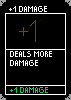
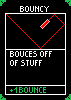
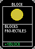
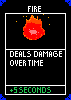
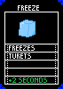

# Druhá sada upgradů: +1 Damage, Bouncy, Block, Fire, Freeze

**Stav:** postaveno, **čeká na test hraním.** Hotová podoba: [features/upgrades.md](../features/upgrades.md).
Po testu se plán přesune do [archive/](archive/README.md).
Navazuje na [upgrades.md](upgrades.md) — systém karet, losování a `GameSession.Stacks` už existují,
tady se přidávají jen nové upgrady a jejich efekty.

## Co to má být `[ZADÁNÍ]`

Zdroj: Viktorův podklad *Upgrades* (PDF) a pět návrhů karet, 06.10.2026. Původní znění:

> +1 damage — adds +1 damage to all projectiles in one burst
> bouncy — projectiles bounce from floor roof and walls. +1 bounce
> block — by pressing assigned button block all incoming projectile duration 1 sec
> fire — turrets hit by the burst light on fire and take damage over time duration 5s. damage each 1s
> freeze — turrets hit by freeze stop shooting and turning for some time duration 2s

Karty (pixel art 71 × 100 px) jsou uložené v `Assets/UI/Upgrades/`. Raritu ukazuje barva rohů,
změřená přímo z PNG:

| Karta | Upgrade | `id` | Rarita (barva rohů) | Text na kartě | Stupeň navíc |
|---|---|---|---|---|---|
|  | **+1 Damage** | `damage` | Common `163,163,163` | „Deals more damage" | +1 DAMAGE |
|  | **Bouncy** | `bouncy` | **Uncommon** `31,196,78` | „Bouces off of stuff" | +1 BOUNCE |
|  | **Block** | `block` | Common `163,163,163` | „Blocks projectiles" | +1 BLOCK |
|  | **Fire** | `fire` | Rare `0,30,255` | „Deals damage over time" | +5 SECONDS |
|  | **Freeze** | `freeze` | Rare `0,30,255` | „Freezes turets" | +2 SECONDS |

Bouncy je **první karta rarity Uncommon** — její zelená nahradí zástupnou barvu `40,200,60`
v `Rarities` (viz otevřená otázka 1 v [upgrades.md](upgrades.md)).

## Co už je připravené

- Karta = asset `UpgradeDefinition` v `Assets/Resources/Upgrades/`; nabídka mezi vlnami, katalog
  v menu, konec runu i konzole v sandboxu ([sandbox-console](archive/sandbox-console.md)) nové
  upgrady najdou samy. Nabídka (`RunUI.cardsOffered = 5`) s osmi upgrady poprvé ukáže plných 5 karet.
- `Shoting.FireOne` nastavuje upgrady raketě v okamžiku výstřelu — sem přibude damage, odrazy,
  oheň a mráz.
- `RocketProjectile` má sweep s `hit.point` a `hit.normal` — přesně to, co odraz potřebuje.
- `DroneControls.Stun()` je jediné místo, kudy jde každý zásah drona (kámen, blesk, výbuch, homing),
  takže Block stačí hlídat tam.

## Plán implementace

### Dohodnuto s Viktorem (06.10.2026)

- **Block:** nabití = počet karet, jedno se doplní za 8 s. **Po dobu bloku zežloutne okraj
  obrazovky.** Klávesa **`F`**; switch na vysílačce doplní Viktor později.
- **Fire:** 2 damage za tik, **+1 Damage zvedá i tik ohně**.
- **Skoky Lightning zapalují i mrazí** stejně jako přímý zásah.
- **Zmrzlý boss** nevyhodí salvu koulí — časovač salvy stojí, dokud je zmrzlý.
- Bouncy od turretu neodráží (otázka 6 bez odpovědi — výchozí návrh).

### Jak se sčítají stupně

| Upgrade | 1 karta | každá další karta |
|---|---|---|
| +1 Damage | +1 damage každé raketě | +1 |
| Bouncy | 1 odraz | +1 odraz |
| Block | 1 nabití štítu | +1 nabití |
| Fire | hoří 5 s | +5 s (10, 15 …) |
| Freeze | zamrzne na 2 s | +2 s (4, 6 …) |

### +1 Damage — `Shoting`, `RocketProjectile`

- `FireOne`: `proj.damage += bonus + Stacks(damage)` — dostane ji **každá raketa dávky** (Double
  Strike), jako bonus z kruhů. Lightning počítá skok z `damage`, takže ho to zvedne samo.
- **Pozor na blikání:** `RocketProjectile` dnes bliká, když `damage > 10`. S touto kartou by blikala
  každá raketa. Nové pole `boosted` (nastaví `Shoting`, jen když je bonus z kruhů > 0) nahradí
  test `damage > 10`.

### Bouncy — `RocketProjectile`

- `bouncesLeft = Stacks(bouncy)`. Ve `FixedUpdate`, když sweep trefí něco, **co není turret**
  (podlaha, stěny, strop arény, terén a plošina v SampleScene) a `bouncesLeft > 0`:
  směr = `Vector3.Reflect(dir, hit.normal)`, pozice = `hit.point + hit.normal * 0.05`, otočit
  `rb.rotation` i `transform.rotation`, `bouncesLeft--`, malá jiskra (`ImpactExplosion`, `scale ≈ 0.4`).
  Raketa **není** `consumed` a letí dál.
- Turret raketa trefí normálně (damage, Lightning, Fire, Freeze). Odraz jen přes sweep — záložní
  trigger nemá skutečnou normálu, ten raketu odpálí jako dnes.
- Raketa, která se odrazí zpátky na drona, jím proletí (filtr `owner`), dron nic nedostane.
- Homing po odrazu dál zatáčí na svůj cíl. `lifeTime` zůstává 5 s (600 m při 120 m/s), takže
  odrazy nekončí dřív, než raketa doletí.

### Block — `DroneControls`, `DroneHUD`

- **Vstup** v `DroneControls` (už tam je vysílačka i klávesnice; třetí kopie hledání zařízení nevznikne):
  klávesa **`F`** (návrh), na vysílačce zatím nic — cestu ke switchi musí Viktor zjistit
  logováním v `Start()` (viz [radiomaster-pocket.md](../reference/radiomaster-pocket.md)).
- Stisk s nabitím > 0 → `blockUntil = Time.time + blockDuration` (1 s), nabití −1.
- `Stun(seconds, kind, blockable = true)`: během bloku se zásah **zahodí** — žádný stun a žádné
  i-frames. Stěna arény na Easy volá `blockable: false`, protože není projektil. Projektil sám
  vybuchne normálně (výbuch je vidět), jen dron nic neschytá — to pokryje kámen, blesk, výbuch
  červeného i homing najednou.
- **Nabíjení (návrh):** maximum = počet karet; jedno nabití se doplní po `blockRecharge` (8 s).
  Funguje stejně v Aréně, sandboxu i SampleScene, bez vazby na `RunManager`.
- **HUD:** žluté body (jako kruh na kartě) pod zaměřovačem = počet nabití; během bloku žlutý
  okraj obrazovky (stejná technika jako vinětka stunu). Bez karty se nic nekreslí.
  `DroneControls` dá HUDu jen ke čtení `IsBlocking`, `BlockCharges`, `MaxBlockCharges`.

### Fire — `EnemyTurret`, nový `TurretBurnFx`

- Přímý zásah raketou → `turret.Ignite(5 s × stupeň, fireTickDamage)`. Další zásah dobu
  **obnoví na plnou**, nesčítá víc ohňů najednou.
- Tik každou 1 s přes `TakeDamage` (statistiky i zabití fungují samy). Tik musí běžet v `Update`
  **před** návraty kvůli dosahu a hráči — hořet má i turret, který na drona nevidí.
- **Damage za tik** zadání neurčuje — návrh **2** (5 s = 10 HP, tj. jedna raketa navíc), pole
  v Inspectoru na `Shoting`.
- Vizuál `TurretBurnFx`: oranžové plameny jako `ParticleSystem` z kódu (`FxAssets.AdditiveDot`, HDR
  přes `FxAssets.Tint`, `ps.Stop(...)` hned po `AddComponent` — viz CLAUDE.md). **Nebude potomkem
  turretu**: kořen bosse má měřítko 3, takže pozici kopíruje v `LateUpdate` z `AimPoint` (stejně jako
  `DroneStunArcs`) a zničí se, když turret zmizí.

### Freeze — `EnemyTurret`, `BossTurret`

- Přímý zásah → `turret.Freeze(2 s × stupeň)`, `frozenUntil = max(...)`. Zmrzlý turret v `Update`
  neotáčí hlaveň a nestřílí; po rozmrznutí pokračuje, kde přestal.
- `BossTurret`: zmrzlý boss **posune salvu barevných koulí** až za rozmrznutí (návrh).
- Vizuál: ledově modrý `_BaseColor` na rendererech turretu přes `MaterialPropertyBlock` (nikdo jiný
  na ně property block nepíše), po rozmrznutí `Clear()`. Případně pár modrých jisker.

### Společná pravidla Fire a Freeze

- Platí **„turrets hit by the burst"**: každá raketa dávky, která turret přímo trefí.
- **Skoky Lightning zapalují a mrazí taky** (Viktor, 06.10.2026).
- Nastavení ve `Shoting` vedle ostatních upgradů: `fireDurationPerStack`, `fireTickDamage`,
  `fireTickInterval`, `freezeDurationPerStack`; `RocketProjectile` je dostane při výstřelu
  (`[NonSerialized]`, stejně jako Homing a Lightning).

### Data a builder

- `UpgradeIds`: `Damage`, `Bouncy`, `Block`, `Fire`, `Freeze`.
- `UpgradesBuilder.Specs`: pět nových záznamů (anglické popisy); builder vytvoří jen chybějící
  assety a nastaví import obrázků (Point, bez komprese).
- `Rarities`: Uncommon = `31,196,78` z karty Bouncy.

### Soubory

- **Nové:** `Assets/scripts/TurretBurnFx.cs`, 5 PNG v `Assets/UI/Upgrades/` (už zkopírované,
  `.meta` vytvoří Unity), 5 assetů v `Assets/Resources/Upgrades/` (builder).
- **Úpravy:** `UpgradeDefinition.cs` (ids, barva), `Shoting.cs`, `RocketProjectile.cs`,
  `EnemyTurret.cs`, `BossTurret.cs`, `DroneControls.cs`, `DroneHUD.cs`,
  `Assets/Editor/UpgradesBuilder.cs`; dokumentace (features/upgrades.md, decisions.md, CLAUDE.md).

### Ověření

1. Headless kompilace, `UpgradesBuilder.BuildAll`; kontrola 8 assetů a importu obrázků.
2. Viktor v sandboxu přes konzoli:
   - `damage` ×2 → turret ztrácí 12 za raketu; rakety **neblikají**, dokud neproletí kruhem.
   - `bouncy` → raketa do podlahy/stěny se odrazí s jiskrou; ×2 dva odrazy; turret odrazem netrefí jinak než přímo.
   - `block` → `F` = žlutý okraj 1 s, zásah v něm nic neudělá; nabití se doplní; na Easy stěna pořád omráčí.
   - `fire` → turret hoří 5 s, ubývá po 1 s; ×2 → 10 s; zabití ohněm se započítá.
   - `freeze` → turret zmodrá, 2 s nestřílí ani se netočí; boss při zmrazení nevyhodí koule.
3. Arena: po vlně se nabídne 5 různých karet, Bouncy se zeleným rámečkem rarity.

### Mimo rozsah

Block na vysílačce (dokud není známá cesta ke switchi), ukládání upgradů, ESC přehled.

## Odchylky při implementaci

- Oheň i mráz kreslí jedna komponenta **`TurretStatusFx`** (místo samotného `TurretBurnFx`);
  `EnemyTurret` ji přidá až při prvním zapálení nebo zmrazení.
- Mráz je jen modrý tón přes `MaterialPropertyBlock`, bez jisker.
- Nabití bloku na HUD jsou malé žluté čtverečky pod zaměřovačem (UI tu nemá sprity, viz #12).
- Tik ohně: `fireTickDamage` (2) + počet karet +1 Damage, nastavuje `Shoting` při výstřelu.

## Otevřené otázky `[OTEVŘENÉ]`

1. ~~Block — nabíjení~~ **ROZHODNUTO 06.10.2026** — nabití = karty, doplnění 8 s.
2. **Block na vysílačce** — který switch (SA–SD/SE); cestu zjistit logováním v
   `DroneControls.Start()`. Dnes jen `F`.
3. ~~Fire — damage za tik~~ **ROZHODNUTO** — 2, +1 Damage ho zvedá.
4. ~~Lightning a ailmenty~~ **ROZHODNUTO** — skoky zapalují i mrazí.
5. ~~Freeze a boss~~ **ROZHODNUTO** — salva čeká.
6. **Bouncy od turretu** — zatím ne (každý zásah turretu je zásah); bez odpovědi.

## Souvisí

[upgrades.md](upgrades.md), [features/upgrades.md](../features/upgrades.md),
[features/stun.md](../features/stun.md), [features/player-rockets.md](../features/player-rockets.md),
[decisions.md](../decisions.md) #10, #12, #26.
